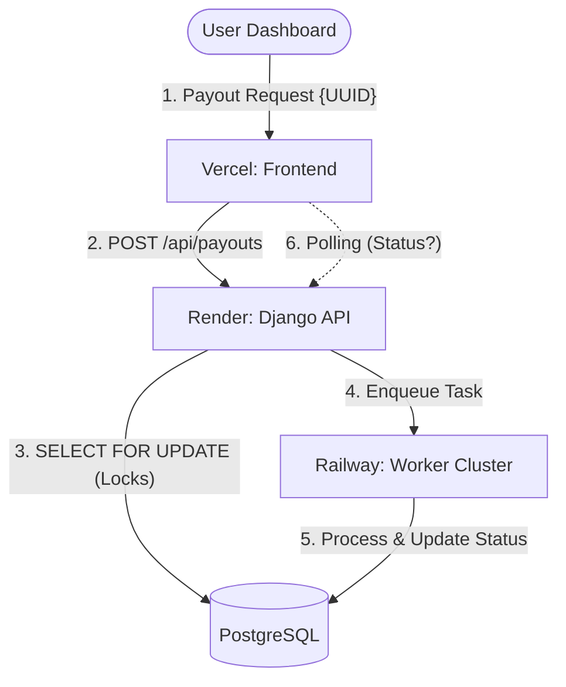
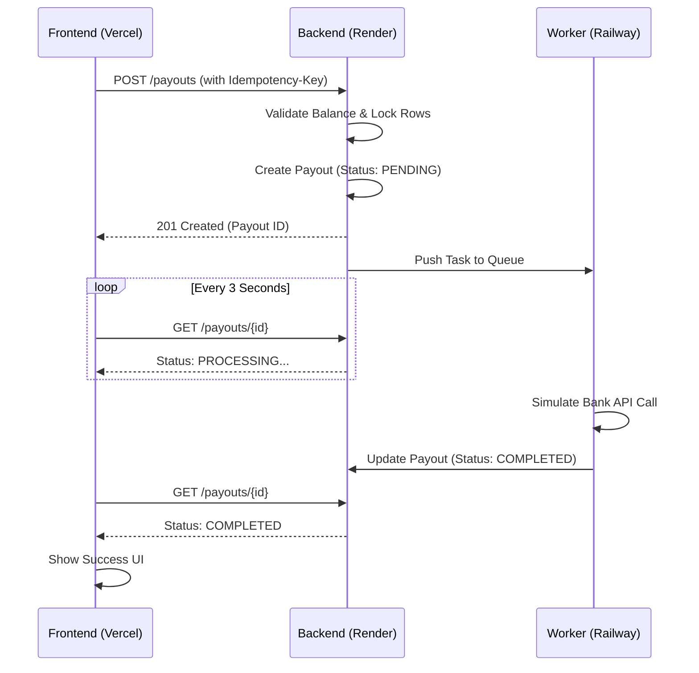

# Playto Pay System Architecture

This document provides a comprehensive technical overview of the engineering principles, architectural patterns, and distributed deployment strategies powering the **Playto Pay** financial engine.

---

## 🏗 High-Level System Flow

The system operates as a distributed triangle between the user's browser, the synchronous API, and the asynchronous worker cluster.

---

## 💎 Core Engineering Principles

### 1. Unified Ledger System (Immutable Math)
- **The Problem:** Conventional databases store a `balance` column. In high-concurrency environments, updating this column is prone to "race conditions"—where two processes read the same balance and overwrite each other, leading to "money creation" or "loss."
- **The Solution:** We use a **Double-Entry Ledger**. No merchant has a stored balance. Instead, a merchant's balance is a **computation**, not a **column**.
  - **Transaction Integrity:** Every financial event is an immutable row.
  - **Negative Holds:** When a Payout starts, we record a `PAYOUT_HOLD` (negative value). This immediately "locks" those funds from the computed balance.
  - **Fail-Safe Refunds:** If the bank API fails, we don't delete the hold; we issue a `PAYOUT_REFUND` (positive value) to net it out.

### 2. Concurrency & Double-Spend Protection
To mathematically guarantee that a merchant cannot spend more than they have during simultaneous requests, we implement **Row-Level Locking**:
- When a request hits the API, Django executes a `select_for_update()` on the merchant's ledger entries.
- This creates a database-level lock. Any other request for the same merchant must wait until the first transaction is complete.

### 3. Idempotency Tier (Network Fault Tolerance)
We use a robust Idempotency Layer to handle "Zombie Requests" (requests that succeed on the server but time out on the client).
- **Unique Signature:** Every request carries a client-generated `Idempotency-Key`.
- **Outcome Storage:** The backend stores the exact HTTP response body and status code for that key.
- **Replay Logic:** If the client sends the same key again, the backend skips all logic and immediately returns the stored response.

---

## 🔄 Lifecycle: Asynchronous Polling Pattern

Because bank API calls can take 10-60 seconds, we never keep an HTTP request open. We use a "Submit and Poll" pattern.

---

## 🌍 Distributed Deployment Model

We isolate the "brain," the "muscle," and the "interface" across different infrastructures to ensure that a spike in one doesn't bring down the others.

| Component | Provider | Strategic Advantage |
| :--- | :--- | :--- |
| **Frontend (Dashboard)** | **Vercel** | Global Edge caching and lightning-fast SPA (Single Page Application) navigation. |
| **Synchronous API** | **Render** | Managed environments for Django and PostgreSQL with seamless horizontal scaling for web traffic. |
| **Asynchronous Worker** | **Railway** | High-performance container execution for the `qcluster`, allowing us to scale the "payout processing" power independently of the web API. |

---

## 🛠 Database Schema Overview

The architecture relies on four critical tables:
1.  **Merchants:** The entity ownining the funds.
2.  **LedgerEntries:** The single source of truth for all money movement (Paise-accurate).
3.  **Payouts:** The state-machine records (Pending -> Processing -> Completed/Failed).
4.  **IdempotencyRecords:** The safety net for network retries.

